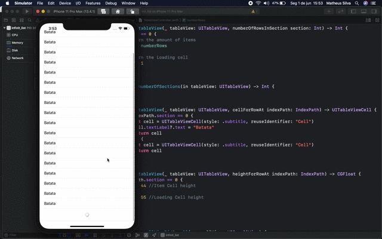

<h1 align="center">Welcome to infinit_list 👋</h1>

  

### 🏠 [Homepage](https://github.com/MaatheusGois/InfinityList#readme)

## Author

👤 **Matheus Gois <matheusgoislimasilva@gmail.com>**

* Website: www.linkedin.com/in/maatheusgois/

* Twitter: [@maatheusgois](https://twitter.com/maatheusgois)

* GitHub: [@maatheusgois](https://github.com/maatheusgois)  

* LinkedIn: [@maatheusgois](https://linkedin.com/in/maatheusgois)

* Dribbble: [@maatheusgois](https://dribbble.com/maatheusgois)

***
_For God so loved the world that he gave his one and only Son, that whoever believes in him shall not perish but have eternal life. 🙌🏻 John 3:16 [read-the-bible](https://biblia.com/bible/esv/john/3/16)_

_This README was generated with ❤️ by [readme-md-generator](https://github.com/kefranabg/readme-md-generator)_

